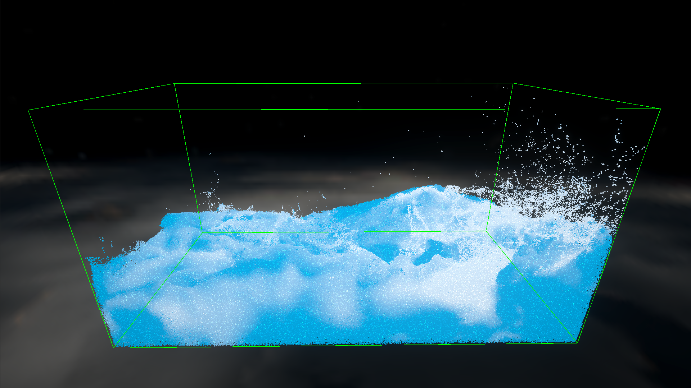
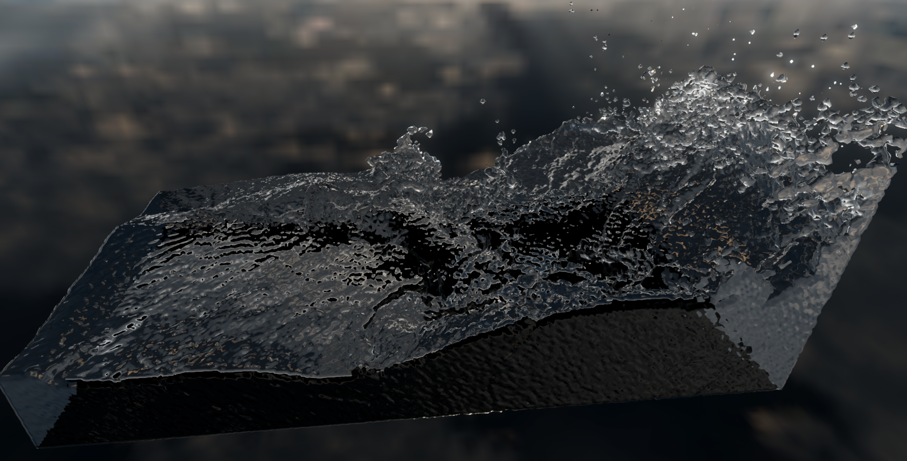
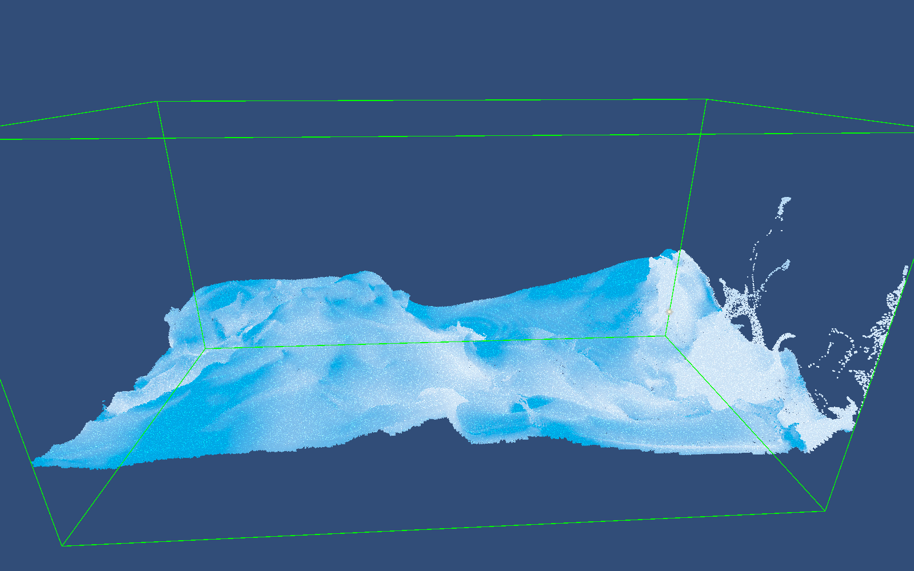
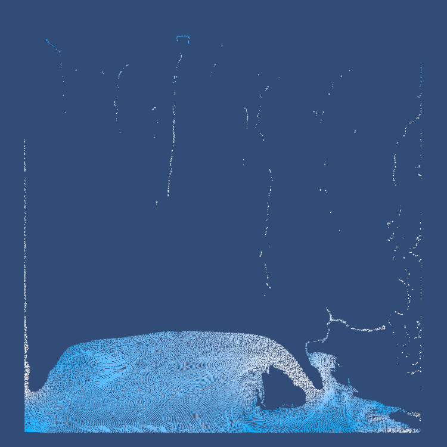

# Unity_FLIP_Fluid_Simulation
FLIP fluid simulation with MGPCG solver in unity

**Warning: it was only tested on my RTX4070 graphics card with wave size 32**

## Assets/GPU_FLIP

A Incompressible inviscid Flow using FLIP written in HLSL

4M particles on 256x128x128 grid, simulated on GPU

The grid is solved with a UAAMGPCG solver, but only one iteration

Implemented the algorithm from the paper **A Fast Unsmoothed Aggregation Algebraic Multigrid Framework for the Large-Scale Simulation of Incompressible Flow** <https://computationalsciences.org/publications/shao-2022-multigrid/shao-2022-multigrid.pdf> as a preconditioner for the conjugate gradient method

fast rendering with fake reflection using mesh from marching cubes

## Assets/NarrowBand

Implemented the algorithm from the paper **Narrow Band FLIP for Liquid Simulations** <https://www.cs.cit.tum.de/fileadmin/w00cfj/cg/Research/Publications/2016/NBFlip/nbflip.pdf>

## Assets/PF_FLIP

2D FLIP using Unity Jobs system.
and some legacy test code

## Assets/MarchingCubesGPU
build surface from density field on GPU

## Assets/Sort
GPU Radix Sort from <https://github.com/b0nes164/GPUSorting>

## Others

Documentation:
<https://zhuanlan.zhihu.com/p/2021899451053213413>

video:
<https://www.bilibili.com/video/BV1usQvByE4h>

### Other Reference
Fast Splat P2G from: **Cirrus: Adaptive Hybrid Particle-Grid Flow Maps on GPU** <https://wang-mengdi.github.io/proj/25-cirrus/>

**FLIP-Fluid for Unity** <https://github.com/abecombe/FLIP-Fluid-for-Unity>